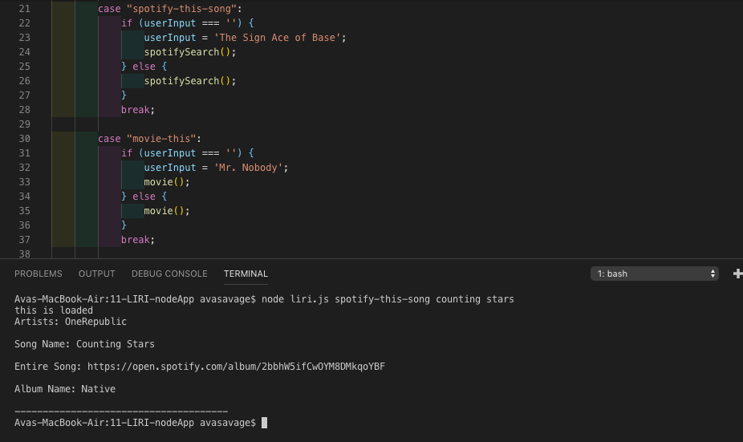

# 11-LIRI-Bot

### Overview

* In this assignment, you will make LIRI. LIRI is like iPhone's SIRI. However, while SIRI is a Speech Interpretation and Recognition Interface, LIRI is a _Language_ Interpretation and Recognition Interface. LIRI will be a command line node app that takes in parameters and gives you back data.

### Before You Begin

* LIRI will search Spotify for songs, Bands in Town for concerts, and OMDB for movies.

* To retrieve the data that will power this app, you'll need to send requests using the `axios` package to the Bands in Town, Spotify and OMDB APIs. You'll find these Node packages crucial for your assignment.

   * [Node-Spotify-API](https://www.npmjs.com/package/node-spotify-api)

   * [Axios](https://www.npmjs.com/package/axios)

     * You'll use Axios to grab data from the [OMDB API](http://www.omdbapi.com) and the [Bands In Town API](http://www.artists.bandsintown.com/bandsintown-api)

   * [Moment](https://www.npmjs.com/package/moment)

   * [DotEnv](https://www.npmjs.com/package/dotenv)

### Instructions:

* user chooses from four commands:
  * concert-this + user search term
  * spotify-this-song + user search term
  * movie-this + user search term (for movies with apostrophe in the name, user must type input in quotes i.e. "pan's labyrinth" or use escape character i.e. pan\'s labyrinth)
  * do-what-it-says (app will choose at random from random.txt)

* use example: $ node liri.js movie-this deadpool

### Images and Video of App:
* Bands in Town inquiry:

* Spotify inquiry:

* OMDB inquiry:

* ReadFile random.txt:

* Running Liri with no command input:

* Running Liri with no Movie input:

* Running Liri with no Song input:

* Liri App Video:
  * Liri will default to Entire Song, instead of Song Preview when Spotify information does not have Song Preview Available.

  * It took several tries to find a song with only a Song Preview in the video:

[Click Here to Check Out App Video](https://drive.google.com/file/d/1Ghj8QCyWzJ0AblHRINym1NpwswXP97yK/view)